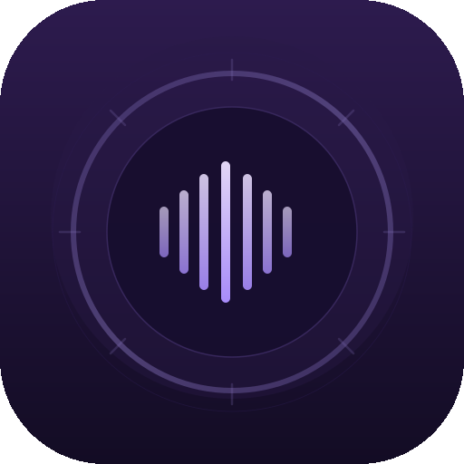
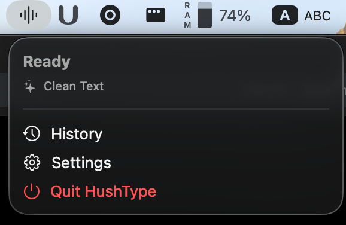

<p align="center">
  
</p>
<h1 align="center">HushType</h1>
<p align="center"><em>Your voice stays private. Text appears at your cursor.</em></p>

<p align="center">
  <!-- Badges -->
  
  
  
  <!--  -->
  <!--  -->
</p>

---

## What is HushType?

HushType is a **privacy-first, macOS-native speech-to-text application** that lets you dictate text into any app where your cursor is active — without ever sending your voice to the cloud.

Unlike cloud-dependent alternatives (MacWhisper, Superwhisper, Apple Dictation), HushType runs entirely offline using local AI models:

- **[whisper.cpp](https://github.com/ggerganov/whisper.cpp)** for speech recognition with Metal GPU acceleration
- **[llama.cpp](https://github.com/ggerganov/llama.cpp)** for intelligent text post-processing with local LLMs

The app lives in your macOS menu bar and provides global hotkey-activated dictation with six purpose-built processing modes — from raw transcription to LLM-powered text structuring, grammar correction, and prompt formatting.

> **Hush** = your voice stays private, never leaving your device
> **Type** = text appears at your cursor

## Key Features

| Feature | Description |
|---------|-------------|
| **Zero-Network Architecture** | All speech recognition and LLM processing happens locally. No cloud, no telemetry, no data leaves your Mac. |
| **Dual Local AI Pipeline** | whisper.cpp (STT) + llama.cpp (LLM) in one app — a unique combination no competitor offers. |
| **Six Processing Modes** | Raw, Clean, Structure, Prompt, Code, and Custom modes for every use case. |
| **Universal Text Injection** | Dictate into any macOS app — terminals, browsers, IDEs, Slack, and more. |
| **Voice Commands** | Launch apps, manage windows, and control your Mac with voice. |
| **App-Aware Context** | Auto-selects formatting mode based on the active application. |
| **Editable Overlay** | Review and edit transcribed text in a floating window before injection. |
| **90+ Languages** | Full multilingual support with automatic language detection. |

## Tech Stack

| Component | Technology |
|-----------|-----------|
| UI Framework | Swift 5.9+ / SwiftUI / AppKit |
| Speech Recognition | whisper.cpp (C/C++) with Metal acceleration |
| LLM Inference | llama.cpp (C/C++) with Metal acceleration |
| Audio Capture | AVAudioEngine |
| Text Injection | CGEvent API / Clipboard |
| Local Storage | SwiftData |
| Build System | Xcode 15+ / Swift Package Manager / CMake |
| CI/CD | GitHub Actions |
| Auto-Updates | Sparkle |
| Distribution | DMG / Homebrew Cask |

## Quick Start

### Install via Homebrew (recommended)

```bash
brew install --cask hushtype
```

### Install from GitHub Releases

1. Download the latest `.dmg` from [GitHub Releases](https://github.com/hushtype/hushtype/releases)
2. Open the DMG and drag HushType to Applications
3. Launch HushType from Applications

### First Run

1. **Grant Permissions** — HushType will request Accessibility and Microphone permissions
2. **Download a Model** — Open Settings and download a Whisper model (recommended: `small` for balanced speed/accuracy)
3. **Set Your Hotkey** — Default is double-tap Fn or hold Right Option
4. **Start Dictating** — Press your hotkey, speak, and release. Text appears at your cursor.

> 💡 For detailed setup instructions, see the [Quick Start Guide](docs/getting-started/QUICK_START.md).

### Build from Source

```bash
# Clone the repository
git clone https://github.com/hushtype/hushtype.git
cd hushtype

# Build whisper.cpp and llama.cpp
./scripts/build-deps.sh

# Open in Xcode
open HushType.xcodeproj

# Build and run (⌘R)
```

> See the full [Setup Guide](docs/getting-started/SETUP_GUIDE.md) for prerequisites and detailed instructions.

## Processing Modes

HushType's dual AI pipeline gives you six modes for different use cases:

| Mode | What It Does | Best For |
|------|-------------|----------|
| **Raw** | No LLM processing — inject speech exactly as recognized | Quick notes, real-time chat |
| **Clean** | Fix spelling, grammar, punctuation, capitalization | Emails, messages, documents |
| **Structure** | Format as bullet lists, numbered steps, or tables | Meeting notes, outlines |
| **Prompt** | Reformat speech into clear, well-structured AI prompts | Claude, ChatGPT, LLM tools |
| **Code** | Format as code comments, commit messages, docstrings | Development workflows |
| **Custom** | User-defined prompt templates | Anything you need |

## Project Structure

```
HushType/
├── HushType/                    # Main app target
│   ├── App/                     # App entry point, menu bar
│   ├── Views/                   # SwiftUI views (settings, overlay)
│   ├── Services/                # Core services
│   │   ├── AudioCaptureService  # Microphone + AVAudioEngine
│   │   ├── WhisperService       # whisper.cpp Swift wrapper
│   │   ├── LLMService           # llama.cpp Swift wrapper
│   │   ├── TextInjectionService # CGEvent / clipboard injection
│   │   ├── CommandParser        # Voice command parsing
│   │   └── HotkeyManager       # Global hotkey registration
│   ├── Models/                  # SwiftData models
│   ├── Utilities/               # Helpers, extensions
│   └── Resources/               # Assets, prompt templates
├── WhisperKit/                  # whisper.cpp bridging module
├── LlamaKit/                   # llama.cpp bridging module
├── HushTypeTests/               # Unit tests
├── HushTypeUITests/             # UI tests
├── scripts/                     # Build scripts
└── docs/                        # Documentation
```

## Screenshots

<!-- TODO: Add screenshots -->
| Menu Bar | Settings | Overlay |
|----------|----------|---------|
|  |  |  |

## How It Compares

| Feature | HushType | MacWhisper | Superwhisper | Apple Dictation |
|---------|----------|------------|--------------|-----------------|
| Fully Offline | Yes | Partial | Partial | No |
| Local LLM Processing | Yes | No | No | No |
| Voice Commands | Yes | No | No | Limited |
| Processing Modes | 6 | 1 | 3 | 1 |
| App-Aware Context | Yes | No | No | No |
| Open Source | Yes (GPL-3.0) | No | No | No |
| Price | Free | $30+ | $10/mo | Free (limited) |

## Documentation

### Getting Started
- [Quick Start Guide](docs/getting-started/QUICK_START.md) — Up and running in 5 minutes
- [Setup Guide](docs/getting-started/SETUP_GUIDE.md) — Full development environment setup
- [Development Guide](docs/getting-started/DEVELOPMENT_GUIDE.md) — Contributing and extending HushType

### Architecture
- [Architecture](docs/architecture/ARCHITECTURE.md) — System design and component breakdown
- [Tech Stack](docs/architecture/TECH_STACK.md) — Technology choices and rationale
- [Database Schema](docs/architecture/DATABASE_SCHEMA.md) — SwiftData models and relationships

### Features
- [Speech Recognition](docs/features/SPEECH_RECOGNITION.md) — whisper.cpp integration
- [LLM Processing](docs/features/LLM_PROCESSING.md) — llama.cpp and processing modes
- [Text Injection](docs/features/TEXT_INJECTION.md) — How text reaches your cursor
- [Voice Commands](docs/features/VOICE_COMMANDS.md) — System control via voice
- [Model Management](docs/features/MODEL_MANAGEMENT.md) — Downloading and managing AI models
- [Permissions](docs/features/PERMISSIONS.md) — macOS permissions guide

### Operations
- [Deployment Guide](docs/deployment/DEPLOYMENT_GUIDE.md) — Building and distributing releases
- [CI/CD](docs/deployment/CI_CD.md) — GitHub Actions pipelines
- [Monitoring & Logging](docs/operations/MONITORING_LOGGING.md) — Diagnostics and debugging
- [Troubleshooting](docs/operations/TROUBLESHOOTING.md) — Common issues and solutions

### Reference
- [FAQ](docs/reference/FAQ.md) — Frequently asked questions
- [Roadmap](docs/reference/ROADMAP.md) — Development phases and future plans
- [Performance Optimization](docs/reference/PERFORMANCE_OPTIMIZATION.md) — Tuning for speed and efficiency
- [API Documentation](docs/api/API_DOCUMENTATION.md) — Internal Swift APIs

## Contributing

We welcome contributions! See [CONTRIBUTING.md](docs/contributing/CONTRIBUTING.md) for guidelines.

```bash
# Fork and clone
git clone https://github.com/YOUR_USERNAME/hushtype.git

# Create a feature branch
git checkout -b feature/your-feature

# Make changes and test
xcodebuild test -scheme HushType

# Submit a pull request
```

## License

HushType is licensed under the [GNU General Public License v3.0](LICENSE).

Third-party components:
- [whisper.cpp](https://github.com/ggerganov/whisper.cpp) — MIT License
- [llama.cpp](https://github.com/ggerganov/llama.cpp) — MIT License
- [Sparkle](https://github.com/sparkle-project/Sparkle) — MIT License

See [Legal Compliance](docs/security/LEGAL_COMPLIANCE.md) for full attribution and licensing details.

---

<p align="center">
  <strong>HushType</strong> — Privacy-first dictation for macOS.<br>
  Your voice. Your Mac. No cloud required.
</p>
